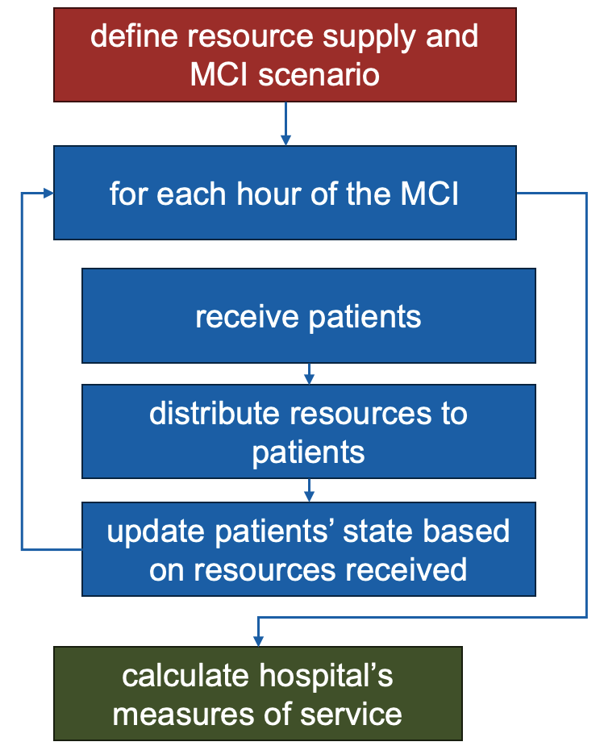
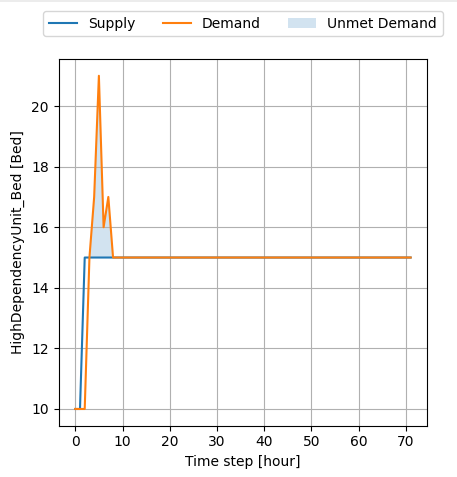

# MCI Planning Tool

## Overview

The Mass Casualty Incident (MCI) Planning Tool supports hospital staff in preparing for an MCI event by assessing hospital performance and the quantity of resources needed to serve the sudden increase in the number of admitted patients. 

This repository contains the source code of the MCI Planning Tool. The MCI Planning Tool is based on the [pyrecodes software](https://nikolablagojevic.github.io/pyrecodes/html/usage/what_is_pyrecodes.html) for recovery modelling and resilience assessment of the built environment. 

Please note that the tool is in its pilot phase and is yet to be tested and improved based on the real-world application experience.

<!-- **Figure 1:** MCI Planning Tool graphical interface. -->

<!--  -->

### Use Examples

The MCI Planning Tool simulates resource supply and demand in a hospital during an MCI and evaluates how unmet resource needs impact patient outcomes, including mortality rates, length of stay, and the number of surgeries performed. Given the complexity of hospital operations, which rely on a wide range of human and material resources, it’s impractical to account for all possible resources. Therefore, the tool focuses on nine critical resources essential for hospital performance: Nurses, Fuel, Water, Oxygen, Medical Drugs (including MCI kits), Medical Equipment, Stretchers, Beds, and Blood.

The use cases for the MCI Planning Tool include:
1. Estimating hospital performance in an MCI scenario. 

<a href="https://youtu.be/KUB-KcLb9FU">
    
</a>

2. Identifying resource bottlenecks and prioritize resources. 

<a href="https://youtu.be/TfrBOuL64D4">
    
</a>

3. Identifying hospital patient capacity considering the available resources in an MCI. 

<a href="https://youtu.be/XIN8CZKvfD0">
    
</a>


### Use Timeline
The MCI Planning Tool is to be used:
1. In the planning phase (i.e., before an MCI) to increase hospital preparedness. 
2. During or shortly before an MCI to identify resource bottlenecks or patient capacity.
3. When planning an intervention in the hospital.

### Users
Primary users of the tool include the hospital staff responsible for organizing and planning the response to an MCI. Both the health and engineering staff should be included.

### Inputs

Data needed to run the MCI Planning Tool is structured in an Excel file and divided into three parts:
1. Data related to the hospital resource supply.
2. Definition of the stress scenario in terms of number and time of arrival of different patient profiles.
3. Resource needs of different patient profiles per department.

An example of the Excel input file can be found in the repository: MCI_Tool_Input_Example.xlsx

### How MCI Planning Tool works

Once the inputs are set and the simulation begins, the MCI Planning Tool simulates the MCI one hour at a time. During each hour, new patients are admitted, and those already in the hospital who have completed their stay in a department move to the next one. The tool then compares the patients' demand for resources within each department to the available supply. If there is an unmet demand, the status of patients who did not receive the needed resources is updated according to the consequences outlined in the input file, in their patient profile. These consequences may include death, an increase in mortality rate, extended length of stay, or surgery cancellation. The duration of the MCI simulation is determined by the user. After the simulation ends, the hospital’s measures of service are calculated based on all patients who visited the hospital during the simulated MCI. Measures of service include mortality rates before and after 24 hours, average length of stay, surgeries performed, and surgeries canceled. The service metrics can be viewed by department and by patient profile.

**Figure 2:** MCI Planning Tool algorithm.



### Outputs
The tool provides two sets of outputs summarized in the report generated by the MCI Planning Tool: 
1. Measures of service characterizing hospital performance such as mortality rate, surgeries performed, and average lengths of stay in an MCI provided per department and patient profile.
2. Resource supply/demand dynamics during the MCI identifying resources whose supply is not sufficient to treat incoming patients.

**Figure 3:** Example of supply/demand dynamics for beds in the High Dependency Unit (HDU) in an MCI scenario. In the first 10 hours of the MCI, the demand for beds in the HDU exceeds the supply (i.e., the number of available beds), leading to unmet demand of patients for HDU beds and, as assumed in the input file, their death.



## Running the MCI Planning Tool

### On Windows

Run the MCI_Planning_Tool_GUI.exe from the MCI_Planning_Tool_Win folder.

### On Mac

Run the MCI_Planning_Tool_GUI.exe from the MCI_Planning_Tool_Mac folder.

### Using the MCI Planning Tool GUI

Three steps are required to run the MCI Planning Tool:
1. Select the excel input file.
2. Choose the MCI scenario type: user-defined or pre-defined (if pre-defined scenario is chosen, provide the parameters).
3. Click Run

## Installation

Follow these steps to install and set up the project on your local machine:

### Clone the Repository

    git clone https://github.com/NikolaBlagojevic/pyrecodes_hospitals.git

### Install dependencies

    pip install -r requirements.txt

### Run the MCI Planning Tool script

Run the MCI_Planning_Tool_GUI.py file.

## License

```
The MCI Planning Tool is licensed under the BSD-3 Clause license. The license is reproduced below:

Copyright (c) 2024 Chair of Structural Dynamics and Earthquake Engineering, ETH Zurich, Switzerland. All rights reserved.

Redistribution and use in source and binary forms, with or without modification, are permitted provided that the following conditions are met:

Redistributions of source code must retain the above copyright notice, this list of conditions and the following disclaimer.

Redistributions in binary form must reproduce the above copyright notice, this list of conditions and the following disclaimer in the documentation and/or other materials provided with the distribution.

Neither the name of the copyright holder nor the names of its contributors may be used to endorse or promote products derived from this software without specific prior written permission.

THIS SOFTWARE IS PROVIDED BY THE COPYRIGHT HOLDERS AND CONTRIBUTORS “AS IS” AND ANY EXPRESS OR IMPLIED WARRANTIES, INCLUDING, BUT NOT LIMITED TO, THE IMPLIED WARRANTIES OF MERCHANTABILITY AND FITNESS FOR A PARTICULAR PURPOSE ARE DISCLAIMED. IN NO EVENT SHALL THE COPYRIGHT HOLDER OR CONTRIBUTORS BE LIABLE FOR ANY DIRECT, INDIRECT, INCIDENTAL, SPECIAL, EXEMPLARY, OR CONSEQUENTIAL DAMAGES (INCLUDING, BUT NOT LIMITED TO, PROCUREMENT OF SUBSTITUTE GOODS OR SERVICES; LOSS OF USE, DATA, OR PROFITS; OR BUSINESS INTERRUPTION) HOWEVER CAUSED AND ON ANY THEORY OF LIABILITY, WHETHER IN CONTRACT, STRICT LIABILITY, OR TORT (INCLUDING NEGLIGENCE OR OTHERWISE) ARISING IN ANY WAY OUT OF THE USE OF THIS SOFTWARE, EVEN IF ADVISED OF THE POSSIBILITY OF SUCH DAMAGE.
```

## Contact Information

For questions, feedback, or support, please reach out to Nikola Blagojevic at blagojevic@ibk.baug.ethz.ch or nikolablagojevicnis@gmail.com.

## Acknowledgments

TODO: Thank ETH4D. Other people from ETH, ICRC Beirut and ICRC HQ.
